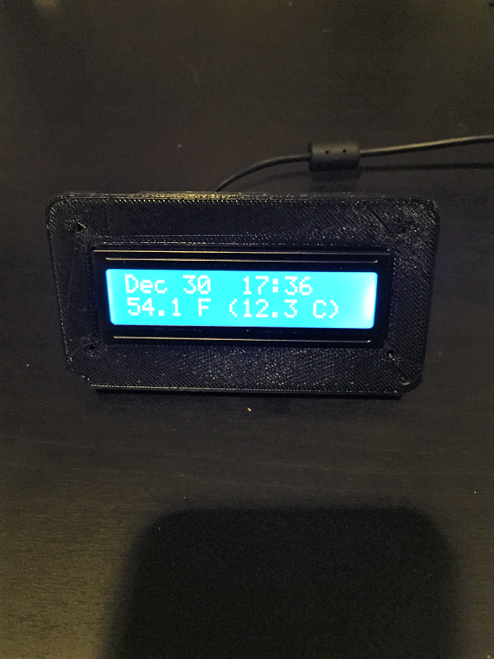
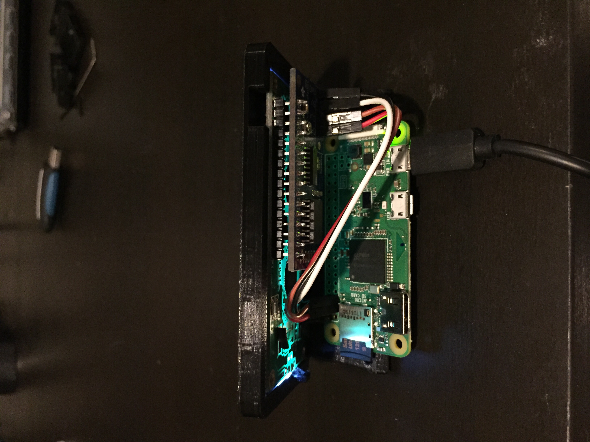

# Vera Endnode B

Wall mounted End node for the Vera using a Raspberry Pi Zero W, Adafruit Arduino RGB 16x2 LCD shield, and a splash of python. 
Displays Date time, weather, and the current mode. Changes Vera modes with the 5 bottons using the built in and documented 
Vera API calls. Does not require anything to be installed on the Vera, this simply sits in the same subnet/vlan and does 
its thing.

I used physical pins 4(5V) 6 (GND) 3(Data SDA) 6(Clock SCL) on the raspberry pi. Make sure you run raspi-config to 
change the hostname (for tracking multiple nodes), password, and enable I2C used by the MCP chip. 

With this node I used a 3D printed case from Thejustintimer (Props) https://www.thingiverse.com/thing:1904529 and DB taped a zero to the base. File is attached if you are too lazy to follow the HL.

After building a node I usually scp (scp -r /home/pi/lcd (newnode):/home/pi/) the runtime directory to a new node 
from one of the already running nodes and run all of the install steps. I know I am lazy.

Endnode A/B

Endnode A is a Raspberry Pi Zero W or Raspberry Pi 3 using an Adafruit MCP23017 shield (5 buttons and RGB)
https://www.adafruit.com/product/716

Endnode B is a Raspberry Pi Zero W or Raspberry Pi 3 using an Adafruit MCP23008 LCD Backpack
https://www.adafruit.com/product/292

These were built on Raspbian Stretch lite in late 2017
***************************************************************************************

For LCD Backpack (MCP23008) (B)

-Clone it

	$ git clone https://github.com/adafruit/Adafruit_Python_CharLCD.git

-Change the Adafruit directory to make things simpler

	$ cd ~/

	$ mv Adafruit_Python_CharLCD/ lcd/

-Enter the relevant directory

	cd ~/lcd

-Install the prereqs

	$ sudo python ez_setup.py

-Install the Adafruit libraries

	$ sudo python setup.py install

-Needed libraries and plugins
	
	$ sudo apt-get install build-essential python-dev python-smbus python-pip

-Install RPi GPIO for Python

	$ sudo pip install RPi.GPIO

-Check to see if I2C is functional, you should see 0x20 lit up

	$ sudo i2cdetect -y 1

Error here? (Not seeing 0x20 lit up) Most likely 1) you wired it up wrong, check your pins (DA,CLK) or 2) you forgot to enable I2C above. If that doesnt fix it look for cold solder joints.

-Enter the examples directory and test the LCD shield
	
	$ cd examples/
	$ python char_lcd_backpack.py

Error here? Try adjusting your contrast pot on the back of the shield while the script is running. If you see the backlight flash and no characters, there is your smoking gun.

-Create your runtime, then copy and paste the Node A code into it, save and exit
	
	**CHANGEME! - Dont forget to add your Vera address and Wunderground API key where annotated**
	$ vi lcd_runtime.py

-Test it

	$ python lcd_runtime.py

-Now to have it run once the RPI boots up

	$ chmod 755 lcd_runtime.py

-Test it

	$ ./lcd_runtime.py

-Error here? (import: command not found etc) Its most likely the case that the shebang (#!/usr/bin/env python) either is missing or not on the very first line of the script. You know what to do....put it on line one. save. try again.

-Add it to rc.local
	
	$ sudo nano /etc/rc.local

-Add this line at the bottom but before 'exit 0'

	$ /home/pi/lcd/lcd_runtime.py &

# FIN.

